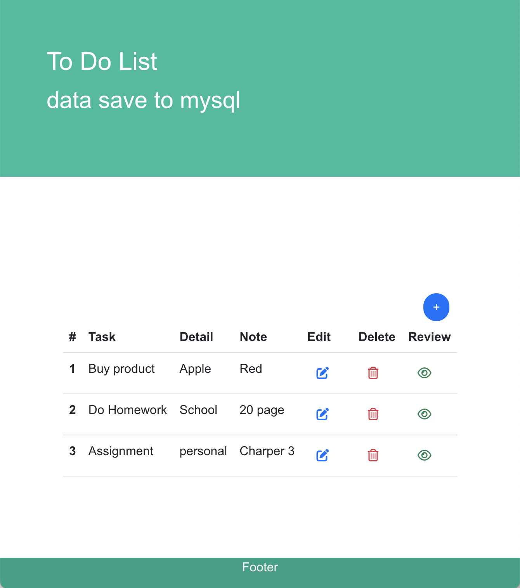
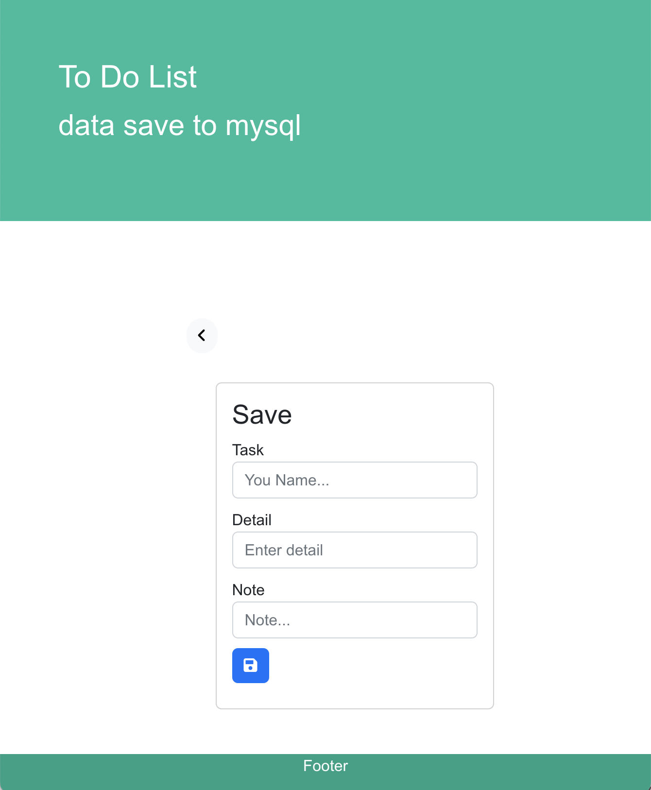
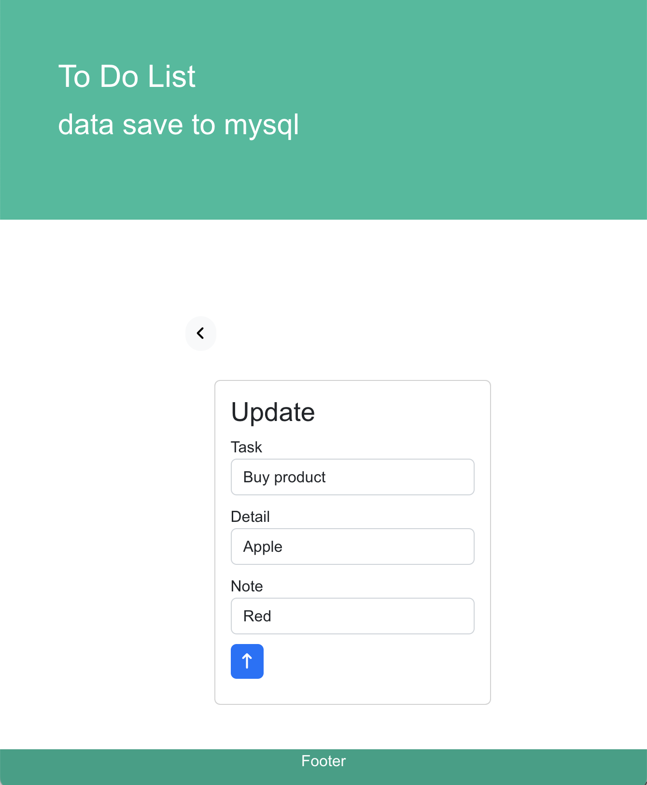
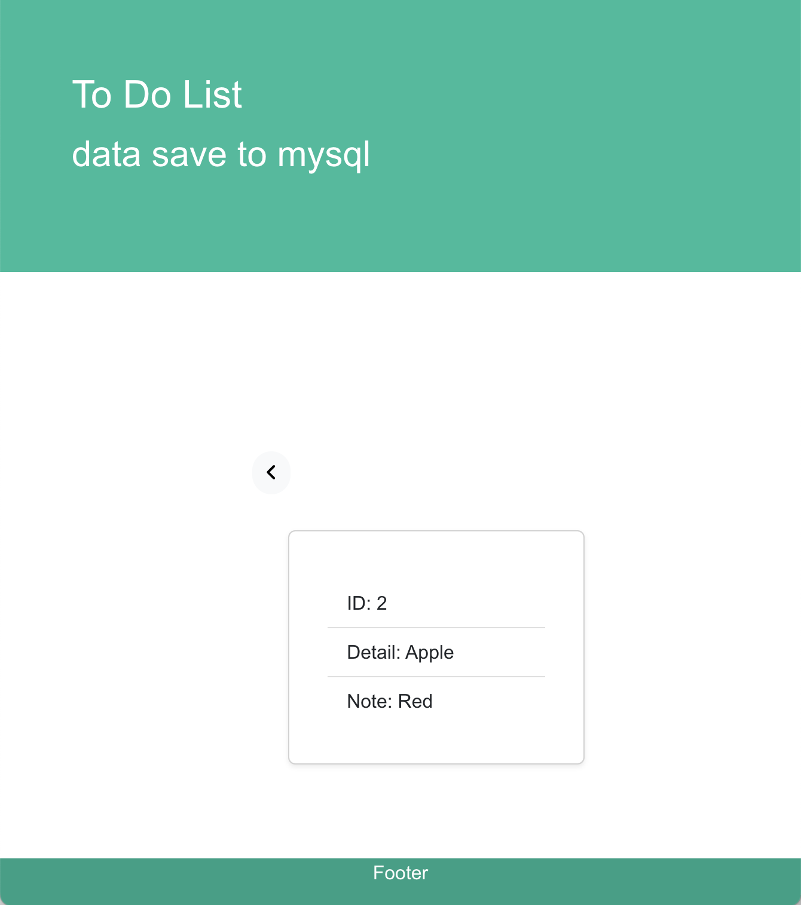

# To Do List Client

## Technology
React
Node.js

## Function
### Home Page
view Task

### Add Task Page
Add Task

### Edit Page
Edit Task

### View Page
View Task



---

# To Do List Server

## Technology
Node.js
Mysql

## Get All Task
Method: GET
URL:
http://localhost:3001/api/task

```
[{"id":2,"task":"Buy product","detail":"Apple","note":"Red"},{"id":3,"task":"Do Homework ","detail":"School","note":"20 page"},{"id":4,"task":"Assignment","detail":"personal","note":"Charper 3"}]
```

## Get One Task
Method: GET

URL:
http://localhost:3001/api/task/ + task id

Example
http://localhost:3001/api/task/2


```
[{"id":2,"task":"Buy product","detail":"Apple","note":"Red"}]
```

## Add Task
Method: POST

Requests json data format
| Key    | Value       | Value Data type |
| ------ | ----------- | --------------- |
| task   | task name   | String          |
| detail | task detail | String          |
| note   | task note   | String          |

URL:
http://localhost:3001/api/task/


## Update Task
Method: PUT

Requests json data format
| Key    | Value       | Value Data type |
| ------ | ----------- | --------------- |
| task   | task name   | String          |
| detail | task detail | String          |
| note   | task note   | String          |

URL:
http://localhost:3001/api/task/

## Delete Task
Method: DELETE

URL:
http://localhost:3001/api/task/ + task id

Example
http://localhost:3001/api/task/2